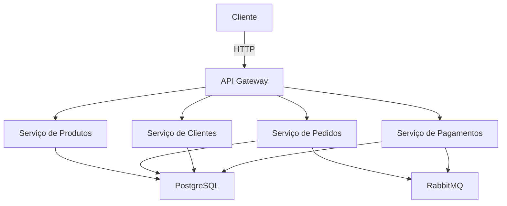

# E-commerce API

API de e-commerce desenvolvida com Node.js, seguindo as melhores práticas de desenvolvimento e arquitetura limpa.

## 🚀 Tecnologias

- Node.js
- TypeScript
- Express
- PostgreSQL
- RabbitMQ
- Docker
- Jest
- Swagger

## 📋 Pré-requisitos

- Node.js 18+
- Docker e Docker Compose
- Git

## 🏗️ Arquitetura

O projeto segue os princípios da Clean Architecture e DDD (Domain-Driven Design):

```
src/
├── application/     # Casos de uso da aplicação
├── domain/         # Entidades e regras de negócio
├── infrastructure/ # Implementações de banco de dados, mensageria, etc
├── interfaces/     # Controllers e rotas da API
└── shared/         # Código compartilhado entre as camadas
```

### Diagrama de Arquitetura



## 🔄 Fluxo de Dados

1. **Produtos**
   - Cadastro e gestão de produtos pelos vendedores
   - Consulta de produtos pelos clientes

2. **Carrinho**
   - Adição/remoção de itens
   - Cálculo de totais e descontos

3. **Pedidos**
   - Criação de pedidos
   - Acompanhamento de status
   - Notificações via RabbitMQ

4. **Pagamentos**
   - Processamento assíncrono
   - Integração com gateway de pagamento
   - Notificações de status

## 🚀 Instalação e Execução

1. Clone o repositório:
```bash
git clone https://github.com/marcosvrc/ecommerce-node-api.git
cd ecommerce-node-api
```

2. Instale as dependências:
```bash
npm install
```

3. Configure as variáveis de ambiente:
```bash
cp .env.example .env
```

4. Inicie os serviços com Docker:
```bash
docker-compose up -d
```

5. Execute as migrações:
```bash
npm run migrate
```

6. Inicie a aplicação:
```bash
npm run dev
```

## 🧪 Testes

Execute os testes unitários:
```bash
npm test
```

Para cobertura de testes:
```bash
npm run test:coverage
```

## 📚 Documentação da API

A documentação completa da API está disponível em:
- Swagger UI: http://localhost:3000/api-docs
- Postman Collection: [Link para download](docs/postman_collection.json)

## 📦 Endpoints Principais

- `POST /api/v1/customers` - Cadastro de clientes
- `POST /api/v1/products` - Cadastro de produtos
- `GET /api/v1/products` - Listagem de produtos
- `POST /api/v1/cart` - Gerenciamento do carrinho
- `POST /api/v1/orders` - Criação de pedidos
- `POST /api/v1/payments` - Processamento de pagamentos

## 🤝 Contribuindo

1. Faça o fork do projeto
2. Crie sua feature branch (`git checkout -b feature/MinhaFeature`)
3. Commit suas mudanças (`git commit -m 'feat: Minha nova feature'`)
4. Push para a branch (`git push origin feature/MinhaFeature`)
5. Abra um Pull Request

## 📝 Licença

Este projeto está sob a licença MIT. Veja o arquivo [LICENSE](LICENSE) para mais detalhes.